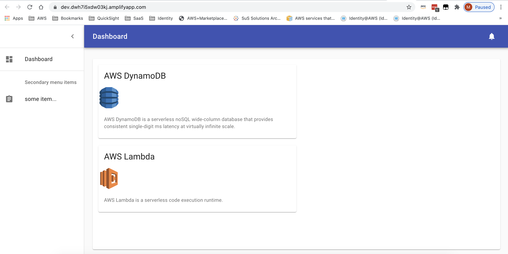

# AWS Amplify - Flashcard App Demo

Documentation is light at the moment. 

TLDR; this project creates a demo flashcard web app with ReactJS and AWS Amplify. 

* Storage in S3 for image icons (`amplify add storage`)
* Cognito for authentication (`amplify add auth`)
* GraphQL API and data store for flashcard metadata (`amplify add api`)
* Hosting with the AWS Amplify Console (`amplify add hosting`)

Currently, the project requires that you manually create the flashcard metadata in DynamoDB. You should use the AppSync "Query" console in the browser because this will ensure that proper attributes are present. If you do not include proper attributes, the subsequent GraphQL query APIs may fail if missing or unexpected fields are present. 

Similarly, this project will create an empty S3 bucket. You need to upload your icons to `s3://YOUR_BUCKET/public/icons/...`. Note that the Amplify `Storage` API will (by default) preprend any S3 keys you give it with `public/`, so when you're storing the image value in DynamoDB, you will leave this prefix out (e.g. `icons/some_icon.png`).

The project does not currently provide a CRUD interface, though the GraphQL apis already exist and you would (mostly) just need to build out the React frontend forms. 

